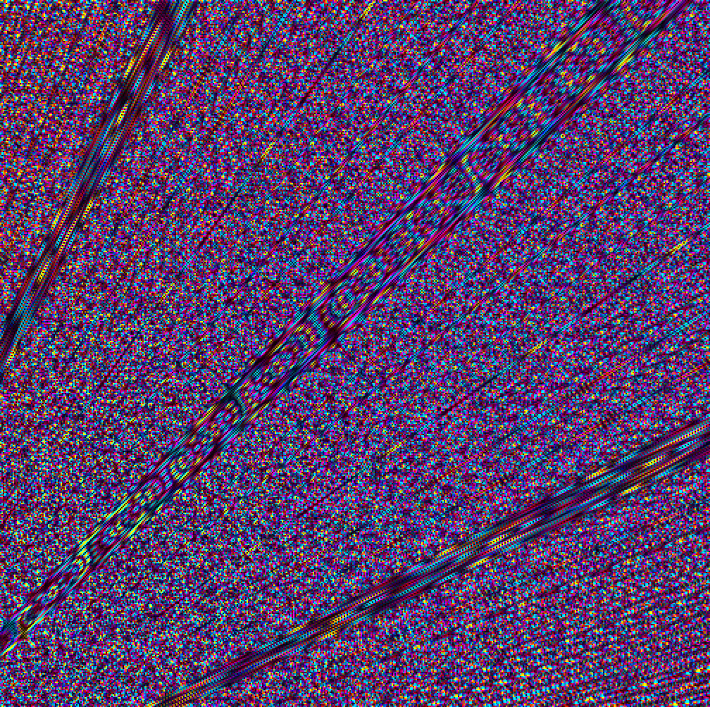

## How to Run
1. **Download the Project:**
   - Click the green **Code** button on this page.
   - Select **Download ZIP**.
   - Extract the downloaded ZIP file to your computer.

2. **Run the Script:**
   - Open the folder and double-click on `singularity_sandbox.py` to run the script.
   - You may need to right click -> Open with -> Python.
   - Make sure Python is installed on your system!

3. **Install Dependencies (if needed):**
   If you encounter errors, you may need to install the required libraries:

   pip install pygame numpy PyOpenGL scipy matplotlib

---

Features:

Real-time fractal rendering with stunning visuals
Adjustable zoom and pan controls
Dynamic and colorful effects
Transparent text overlays for zoom level and iteration tracking

Controls:
W/A/S/D: Pan the view
Up/Down Arrow Keys: Zoom in/out
